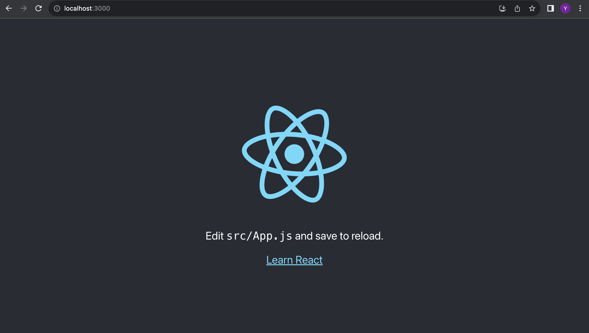

# PCSD Project Team 4

# Overview

Target: implement 調整さん

Frontend with React.js:

- Home page
    - more convenient and flexible Date/Time input
- Event page
    - handle user input of schedule and send to backend api

Backend with Golang:

- add new user time slots

# Environment Prerequisites

Before we start coding, we need to have some software downloaded and installed.

## Docker

To enable cross-platform feature of our app, we use docker to ensure the development environment is identical on different OS (Windows, MacOS, Linux, etc). Check here to download and install docker.

[https://docs.docker.com/get-docker/](https://docs.docker.com/get-docker/)

Except for docker engine, sometimes we need to install docker-compose manually. See here

[https://docs.docker.com/compose/install/](https://docs.docker.com/compose/install/)

Check if installation was successful

```bash
docker -v
docker-compose -v
```

## Go

We use go to handle our backend service, check their official document here.

[https://go.dev/doc/install](https://go.dev/doc/install) 

Check if installation was successful

```bash
go version
```

## Node.js

Although Node.js is not required for deploy the final product, it is needed during development period.

[https://nodejs.org/en/download](https://nodejs.org/en/download)

Check if installation was successful

```bash
node -v
npm -v
npx -v
```

# Build with Existing Code

Of course we need to synchronize all members’ progress and collaborate. To get started with our existing code, please follow the steps below.

## Step 1 - Clone the Repository

- Clone the code from our repo and move into the folder.
    
    ```bash
    git clone https://github.com/QiuMatthew/chouseisan
    cd chouseisan
    ```
    
- Inside our repository, the file structure look like this
    
    ```bash
    .
    ├── LICENSE
    ├── backend
    │   ├── Dockerfile
    │   ├── go.mod
    │   ├── go.sum
    │   ├── main.go
    │   └── schedule
    │       ├── schedule.go
    │       └── scheduleHandler.go
    ├── docker-compose.yml
    └── frontend
        ├── Dockerfile
        ├── setup-frontend-project.sh
        └── src
            ├── App.css
            ├── App.js
            ├── components
            ├── index.css
            └── index.js
    ```
    

## Step 2 - Setup Go Backend

The backend part can be handled automatically by docker so we don’t bother looking into it.

## Step 3 - Setup React Frontend

We only need a single command to install node modules, move files etc.

- Move inside the frontend directory and run the script `[setup-frontend-project.sh](http://setup-frontend-project.sh)`
    
    ```bash
    bash setup-frontend-project.sh
    ```
    
    or
    
    ```bash
    ./setup-frontend-project.sh
    ```
    

If this does not work for your particular case (maybe using Windows which I did not test on), try the following steps, these are exactly what the above script will do for you. If this worked well, you may move to the next step.

- Move inside the frontend directory and run the commands
    
    ```bash
    cd frontend
    npm i -g create-react-app
    npx create-react-app react-app
    ```
    
    The process might take a few minutes. Once finished, we can find a subdirectory named `react-app` is created, this is where our frontend application is located.
    
- Move inside the created directory and install some node modules we are using. Currently I’m using react-bootstrap and framer-motion therefore installation is required
    
    ```bash
    cd react-app
    npm i react-router-dom react-bootstrap bootstrap framer-motion
    ```
    
- Now your file structure should look like this
    
    ```bash
    .
    ├── LICENSE
    ├── backend
    │   ├── Dockerfile
    │   ├── go.mod
    │   ├── go.sum
    │   ├── main.go
    │   └── schedule
    │       ├── schedule.go
    │       └── scheduleHandler.go
    ├── docker-compose.yml
    └── frontend
        ├── Dockerfile
        ├── setup-frontend-project.sh
        ├── react-app
        │   ├── node_modules
        │   ├── public
        │   └── src
        └── src
            ├── App.css
            ├── App.js
            ├── components
            ├── index.css
            └── index.js
    
    ```
    
- Replace the `frontend/react-app/src` folder with `frontent/src` cloned from our repository

## Step 4 - Start Running

- Get back to the root directory of our project (where `docker-compose.yml` file is located)
- Run our application with docker-compose
    
    ```bash
    docker-compose up --build
    ```
    
    Only add `--build` at first time, this might take several minutes. From the second time, we do not need to build our project again to save time unless there are huge changes.
    
- If the services are successfully started, open your browser and access our frontend page at [localhost:3000/chouseisan](http://localhost:3000/chouseisan) and backend endpoint at [localhost:8080/chouseisan/schedule](http://localhost:8080/chouseisan/schedule).

## Step 5- Happy Coding!

Though here are many bugs in the current code, everything is ready and we can start developing our application!

# Build from Scratch (Not Recommend)

If you want to build everything from zero by yourself, this is the step-by-step instructions for you.

These things are what we need to do

- create a folder for our app, we name it Chouseisan
- get inside `Chouseisan`
- create a `docker-compose.yml` file inside the folder
    
    ```go
    version: '3'
    services:
      frontend-service:
        build: ./frontend
        container_name: chouseisan-frontend-container
        volumes:
          - ./frontend:/app/frontend
        tty: true
        ports:
          - "3000:3000"
        command: sh -c "npm start"
    
      backend-service:
        build: ./backend
        container_name: chouseisan-backend-container
        tty: true
        ports:
          - "8080:8080"
    ```
    
- create two subdirectories `frontend` and `backend`
- create a `Dockerfile` inside each subdirectories
    
    ```docker
    FROM golang:1.21.2-alpine
    RUN apk update && apk upgrade
    
    WORKDIR /app/backend/
    
    COPY . .
    RUN go mod tidy
    
    RUN GOOS=linux GOARCH=amd64 go build -o /app/backend/serve
    
    CMD [ "/app/backend/serve" ]
    ```
    
    ```docker
    FROM node:20.8.0-alpine
    WORKDIR /app/frontend/react-app
    ```
    
- in the `backend` directory, run
    
    ```go
    go mod init chouseisan
    ```
    
    Then you can find a file named `go.mod` in the backend directory
    
- create a `main.go` file in the same directory
    
    ```go
    package main
    
    import (
    	"fmt"
    	"log"
    	"net/http"
    )
    
    func main() {
    	http.HandleFunc("/", func(w http.ResponseWriter, r *http.Request) {
    		fmt.Fprintf(w, "Hello from backend")
    	})
    
    	log.Fatal(http.ListenAndServe(":8080", nil))
    }
    ```
    
- run
    
    ```bash
    go mod tidy
    ```
    
- in the `frontend` directory, check if node is correctly installed
    
    ```bash
    node -v
    npm -v
    npx -v
    ```
    
    If the version is printed, we should be fine.
    
- install the tool `create-react-app` and use this tool to initialize a new react project
    
    ```bash
    npm i -g create-react-app
    npx create-react-app react-app
    ```
    
    This might take several minutes and `create-react-app` will create a new folder named `react-app` inside `Chouseisan/backend` and build a basic template for our react frontend application.
    
- get inside `react-app` , we should see three subdirectories (`node_modules` , `public` and `src` ) and several files. The `src` folder will hold almost all of our source code.
- Now we have everything set up, get back to the root directory of our project (which is `Chouseisan` ), run our application using command
    
    ```bash
    docker-compose up --build
    ```
    
- After the build process is over and the docker-compose is running our services, open browser and access to our frontend at `[localhost:3000](http://localhost:3000)` and we should see a react app default page.
    
    
    
- Access our backend at `[localhost:8080](http://localhost:8080)` and we should see
    
    > Hello from backend
    > 
    
    Which is written in `Chouseisan/backend/main.go`
    

Congrats! Everything is ready, now we can start our development.

# Frontend

# Backend